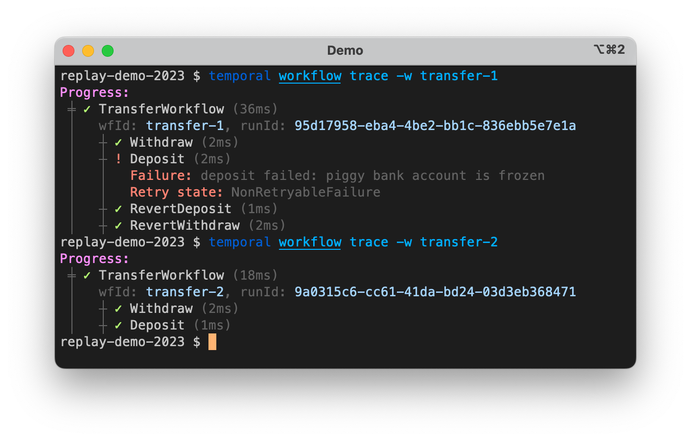

# Replay Demo

Presented by @yiminc at Replay 2023. Code by @yiminc and @Alex-Tideman.

## Setup server locally using single binary:
```shell
temporal server start-dev \
  --dynamic-config-value frontend.enableUpdateWorkflowExecution=true \
  --dynamic-config-value frontend.workerVersioningDataAPIs=true \
  --dynamic-config-value frontend.workerVersioningWorkflowAPIs=true \
  --dynamic-config-value worker.buildIdScavengerEnabled=true
```

Temporal Web UI listens on: http://localhost:8233/

## Run demo via CLI

### Part 1: Workflow Update

Run worker:

```shell
go run worker/main.go
```

Execute two Workflows and then send Updates for them. The first will fail validation and the second will succeed.

```shell
go run democli/main.go update
```

You can take a look at the Workflow Histories in the Temporal Web UI, or use the `temporal` command line tool:



### Part 2: Schedules

```shell
temporal workflow start \
  --workflow-id payment-0 \
  --task-queue demo-tq \
  --type BatchTransferWorkflow
```
```shell
go run democli/main.go schedule
```

## Run demo via UI

### Run HTTP Server
```shell
go run server/main.go
```
Demo's backend server listens on: http://localhost:7654/

### Setup UI
```shell
cd ui
pnpm install
pnpm dev
```
Demo's Web UI listens on: http://localhost:5173/

### Part 1: Workflow Update
* Click 'Transfer' button to initiate transfer (This does the same as democli/main.go update)

### Part 2: Schedules
* Click 'Schedule' button to initiate schedule (This does the same as democli/main.go schedule)

### Part 3: Versioning
* Uncomment local activity part from batch_transfer_workflow.go, change worker/main.go to use 2.0
* Deploy v2 worker: go run worker/main.go